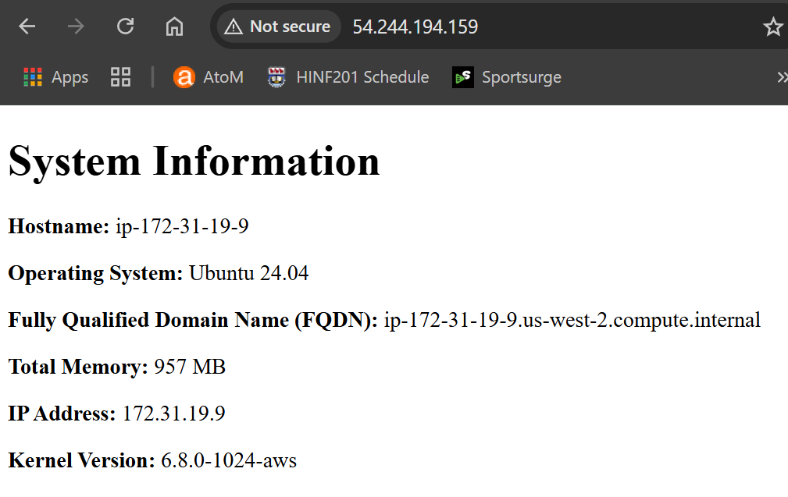

# 4640-w9-lab-start-w25
In this repo we are using terraform, packer, and ansible to create an ec2, that has nginx configured on it.

In your Linux development environment, you'll need to configure the AWS CLI, as this deployment will create an EC2 instance in your us-west-2 region.

### Building the custom ami's using packer
Go to the packer directory
`cd packer`  
run the following packer commands in this order:  
`packer validate .`  
`packer init .`  
`packer build .`  
(i dont know why but it worked this way rather than having the file name in the command)
  
Next
We need to go to the terraform directory
`cd ..`  
`cd terraform`  
    
run the following terraform commands in this order:  
`terraform init`  
`terraform validate`  
`terraform plan`  
`terraform apply`  
  
You can check in AWS that the ec2 instance has indeed been created and go to the public IP address to see whats being displayed on the webpage.

